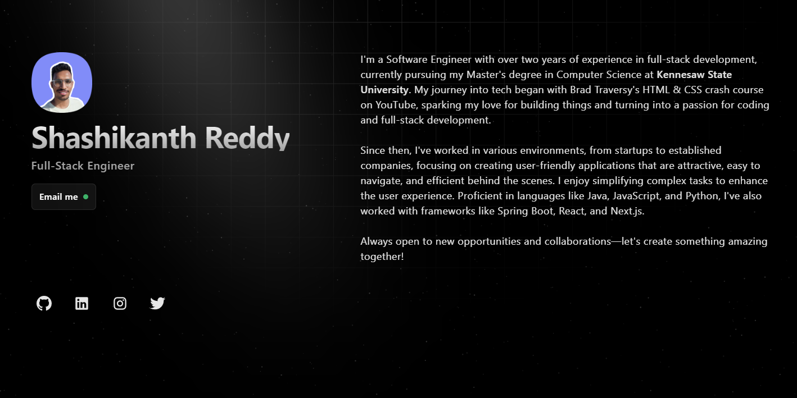

👋 Welcome! This repository contains the source code for my personal portfolio website where I showcase my work, skills, and experiences as a full-stack engineer.

## "Can I use this?" 🤔

Absolutely! Feel free to use this code for your own personal portfolio project. Attribution isn’t required, but it would be greatly appreciated if you give me credit. If you like what you see, don’t forget to ⭐ this repo.

## Tech Stack 🛠️

- [Astro](https://astro.build) as the framework with [React](https://react.dev) as UI library integration.
- [tailwindcss](https://tailwindcss.com) as the styling framework.
- [Cloudflare](https://www.cloudflare.com) for the deplyment through [Cloudflare Pages](https://pages.cloudflare.com).

## Getting Started 🚀

To run this project locally, follow these steps:

1. Clone this repository:

```
$ git clone https://github.com/shashiirk/v3.git
```

2. Navigate to the project directory:

```
$ cd v2
```

3. Install the dependencies:

```
$ pnpm install
```

4. Start the development server:

```
pnpm start
```

The site will be available at `http://localhost:3000`.

## Contributing 🤝

If you find something to improve, feel free to submit a pull request. All contributions are welcome!

## Licence

This project is licensed under [MIT](LICENSE).
